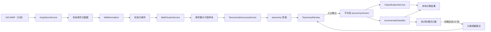

# 163 邮箱分类体系自动发现系统设计

状态：设计与契约阶段（v1）
边界：本阶段不执行 IMAP 同步、不调用模型、不回填分类、不创建任何邮箱标签，也不实现移动、删除、归档或修改已读状态。

## 1. 设计目标与硬约束

系统不再把 Gmail 时期的分类或 `LEGACY_PRIMARY_LABELS` 当作默认分类。分类体系必须来自当前 163 邮箱的真实邮件簇，并经过用户确认后才能用于历史回填和增量分类。

核心不变量：

1. 邮箱访问始终只读；正文读取使用 `BODY.PEEK` 或 ImapFlow 的等效只读下载语义。
2. 邮件身份是 `(account_key, mailbox, UIDVALIDITY, UID)`；`Message-ID` 仅用于辅助去重，不替代 UID 身份。
3. taxonomy 草案没有分类权限；只有不可变的、已确认的 taxonomyVersion 能被分类器使用。
4. 每个 taxonomyVersion 下，每封邮件只能有一个主分类；来源标签、待处理和疑似促销是独立属性。
5. 低于 `0.75` 的结果必须进入 `review`。
6. 模型不能创建、确认或启用分类，也没有任何邮箱工具或写权限。
7. 邮件正文、主题、发件人、附件名和退订字段全部是不可信输入。
8. Gmail/IMAP 文件夹和状态只是分析特征，不能成为最终分类体系的预设答案。

## 2. 总体架构



系统分为两个平面：

- 数据平面：只读同步、标准化、聚类、历史回填、增量分类。
- 控制平面：发现任务、taxonomy 草案、人工编辑、版本确认、调整建议。

控制平面的“确认”是安全闸门。草案可以任意修改、合并、拆分和删除；确认后生成新版本，不原地修改旧版本。

## 3. 模块职责

### 3.1 ImapSyncService

- 以只读 mailbox lock 打开 INBOX。
- 历史同步按 UID 分页；每页提交事务后才推进 `highest_uid`。
- 优先 IDLE，失败达到阈值后轮询；断线按带抖动的指数退避重连。
- 只获取 envelope、flags、internalDate、bodyStructure 和需要的 MIME part。
- UIDVALIDITY 改变时建立新 mailbox epoch，从 UID 1 重新扫描；旧 epoch 保留审计，不覆盖旧邮件。
- SQLite 租约和进程内 Promise 去重保证同一邮箱只有一个同步任务。
- 接口层不暴露 `move/delete/copy/append/storeFlags/expunge` 等方法。

### 3.2 MailNormalizer

标准化结果由 `normalizedMailSchema` 定义，处理规则如下：

- 发件人地址统一小写、去空白；域名使用 IDNA ASCII 规范化。
- 主题模板先去掉 `Re:/Fw:`，再将日期、时间、长数字、订单号、验证码、UUID、哈希和金额替换为占位符。
- 主题模板必须保留业务词，不能把“账单”“登录提醒”“订单成功”等语义词删除。
- 摘要从纯文本优先生成；HTML 先安全转纯文本，删除脚本、样式、追踪像素和外链图片。
- `List-ID` 与 `List-Unsubscribe` 只作为来源/订阅信号；页脚出现“退订、隐私、登录”不能单独决定分类。
- 验证码被替换成 `[verification-code]` 后才可进入样本或日志上下文；原验证码不记录日志。
- 附件仅保存文件名、MIME 类型、声明大小、Content-ID 和 disposition，不下载附件字节。

### 3.3 MailClusterService

聚类是可重复、带版本的离线步骤。第一版使用可解释的分层策略：

1. 强键：规范化 `List-ID`。
2. 次强键：发件人地址或域名 + 主题模板。
3. 弱键：用途信号、时间范围、正文结构指纹和附件类型。
4. 对体量过大且用途混合的簇进行二次拆分。

`fingerprint = SHA-256(cluster_algorithm_version + normalized cluster keys)`。算法或标准化版本改变时创建新的 `cluster_run` 和 `revision`，不静默改写历史发现报告。

每簇最多保留：8 个主题样本、8 个摘要样本、3 个正文样本。先只使用元数据和摘要；只有 `needsBodySample=true` 的簇才从不同时间段选择代表正文。正文样本是有长度上限的安全纯文本，不保存完整 HTML。

### 3.4 TaxonomyDiscoveryService

输入是分页后的邮件簇摘要，不是全部邮件全文。大邮箱采用两阶段 reduce：

1. 每批分析一组邮件簇，生成用途候选和歧义标记。
2. 汇总批结果，生成 8～18 个主分类和每个簇的唯一临时归属。

模型调用使用 OpenAI Responses API，且不传入任何 tools：

```ts
await client.responses.create({
  model: configuredModel,
  store: false,
  instructions: TAXONOMY_DISCOVERY_SYSTEM_INSTRUCTIONS,
  input: serializedBoundedClusterSamples,
  text: {
    format: {
      type: "json_schema",
      name: "taxonomy_discovery_v1",
      strict: true,
      schema: taxonomyDiscoveryJsonSchema,
    },
  },
});
```

Responses API 的 Structured Outputs 在 `text.format` 中配置 `json_schema`；严格模式只支持 JSON Schema 子集，所有对象均设置 `additionalProperties: false`，字段全部列入 `required`。服务仍必须处理 refusal、incomplete、空输出和第二层 Zod 校验失败。[Structured Outputs 官方说明](https://developers.openai.com/api/docs/guides/structured-outputs)、[Responses create API](https://developers.openai.com/api/reference/resources/responses/methods/create)

隐私策略：显式设置 `store:false`，不使用 background/conversation，不上传附件；请求只含经过截断和脱敏的代表样本。`store:false` 不等于零保留承诺，默认 abuse-monitoring 日志策略仍需单独评估；如果邮箱内容敏感，应使用满足需求的数据控制项目。[OpenAI 数据控制说明](https://developers.openai.com/api/docs/guides/your-data#default-usage-policies-by-endpoint)

输出只保存为草案。它不能触发历史回填，也不能成为 active taxonomy。

### 3.5 TaxonomyReview

React 页面包含：

- 邮箱画像：邮件总量、时间范围、主要来源、簇数量、覆盖率、预计“其他”比例。
- 分类卡片：名称、说明、包含/排除规则、预计数量和样本。
- 簇检查器：查看分类下的代表主题/摘要、未读数量、歧义原因。
- 编辑操作：改名、改规则、合并、拆分、删除、重新分配簇。
- 确认操作：显示变更摘要，携带 `expectedRevision` 防止覆盖并发编辑。

确认事务会生成不可变 `taxonomy_versions` 与 `taxonomy_categories` 快照。主分类 ID 一经确认，在该版本内不可变；改名或改规则需要创建下一版草案。

### 3.6 ClassificationService

历史回填按以下优先级运行：

1. 已人工确认且纯净的簇级分类直接复用。
2. 已确认的高精度发件人/List-ID/主题模板规则。
3. 混合簇、规则冲突或歧义邮件才逐封调用模型。

调用模型前，动态 JSON Schema 将 `primaryCategoryId.enum` 限制为 active taxonomyVersion 的分类 ID。没有 active taxonomyVersion 时分类任务拒绝启动。

每次决策记录 taxonomyVersion、路径（cluster/rule/model/manual）、模型、Response ID、prompt/schema 版本、置信度、理由、原始结构化结果和处理时间。低置信度或混合簇进入 review。

### 3.7 IncrementalClassifier

- 新邮件同步后先计算标准化字段和 cluster fingerprint。
- 优先命中已确认的簇与规则；规则必须带来源、版本、精度统计和排除条件。
- 模型输出只能引用 active taxonomyVersion 中的 ID。
- 未识别邮件写入 `unknown_patterns`；相同 fingerprint 累计到 10 封时生成一条 `taxonomy_adjustment_suggestions`。
- 调整建议不会自动改 taxonomy。接受建议只创建新草案，仍需人工确认。

### 3.8 Safety

- 第一版 server 中不存在任何邮箱写接口和 API 路由。
- `MAIL_AUTH_CODE`、`OPENAI_API_KEY` 只存在于 server 环境；数据库只保存账号哈希，不保存邮箱授权码。
- Pino 对 authorization、cookie、password、token、secret、API key 做结构化脱敏；错误字符串再次进行值级脱敏和截断。
- 不记录请求 prompt、完整正文、验证码、授权码或模型输入样本。
- 前端 API 不返回授权信息、完整原始正文、原始 HTML、完整模型请求或敏感 raw result。
- 正文详情只返回按需生成的安全纯文本；默认隐藏外链图片，不渲染邮件 HTML。
- 系统指令与邮件样本使用不同角色；样本包装为 JSON 数据，模型无工具；邮件中的“忽略规则、泄露密钥、调用工具”等文字只作为待分类内容。

## 4. 数据库表结构

SQLite 启用 WAL、foreign_keys、busy_timeout。时间统一存 UTC 毫秒，JSON 列写入前必须经 Zod 校验。下列结构是目标 schema；本阶段不创建迁移。

### 4.1 同步与邮件

| 表 | 关键字段 | 约束与用途 |
|---|---|---|
| `mail_accounts` | `account_key PK`, `provider`, `created_at` | `account_key` 是邮箱地址 SHA-256；不存邮箱地址和授权码 |
| `mailboxes` | `id`, `account_key`, `path`, `uid_validity`, `highest_uid`, `highest_modseq`, `is_current`, `last_synced_at` | 唯一 `(account_key,path,uid_validity)`；每行代表一个 UID epoch |
| `emails` | `id`, `mailbox_id`, `uid_validity`, `uid`, `message_id`, `from_name`, `from_address`, `from_domain`, `subject`, `subject_template`, `summary`, `list_id`, `unsubscribe_json`, `received_at`, `is_unread`, `flags_json`, `imap_labels_json`, `normalizer_version`, `created_at`, `updated_at` | 唯一 `(mailbox_id,uid_validity,uid)`；索引 `message_id/from_domain/subject_template/received_at/is_unread` |
| `email_attachments` | `id`, `email_id`, `filename`, `content_type`, `declared_size`, `content_id`, `disposition` | 只存元数据；不存附件内容 |
| `email_content_samples` | `id`, `email_id`, `purpose`, `safe_text`, `content_hash`, `byte_length`, `redaction_version`, `expires_at`, `created_at` | 有界纯文本样本；唯一 `(email_id,purpose,content_hash)`；不存 HTML |
| `sync_runs` | `id`, `account_key`, `trigger`, `mode`, `status`, `scanned`, `inserted`, `updated`, `failed`, `started_at`, `finished_at`, `safe_error` | 同步审计，错误必须脱敏 |
| `sync_failures` | `id`, `sync_run_id`, `email_id`, `stage`, `error_code`, `safe_message`, `retryable`, `created_at` | 不保存服务器原始响应全文 |
| `sync_locks` | `account_key PK`, `owner_id`, `acquired_at`, `expires_at` | 同一账号单任务租约 |

`mailboxes.is_current` 使用部分唯一索引保证同一 `(account_key,path)` 只有一个当前 epoch。UIDVALIDITY 改变时，旧行 `is_current=0`，新行从 `highest_uid=0` 开始。

### 4.2 聚类

| 表 | 关键字段 | 约束与用途 |
|---|---|---|
| `cluster_runs` | `id`, `account_key`, `algorithm_version`, `normalizer_version`, `status`, `email_count`, `started_at`, `completed_at` | 每次全量/增量聚类的可重现快照 |
| `mail_clusters` | `id`, `cluster_run_id`, `fingerprint`, `revision`, `sender_keys_json`, `domain_keys_json`, `list_ids_json`, `subject_templates_json`, `email_count`, `unread_count`, `date_from`, `date_to`, `mixed_score`, `needs_body_sample` | 唯一 `(cluster_run_id,fingerprint)` |
| `mail_cluster_members` | `cluster_id`, `email_id`, `similarity`, `assigned_by`, `created_at` | 复合主键 `(cluster_id,email_id)`；同一 cluster_run 内邮件只能属于一个簇 |
| `cluster_samples` | `id`, `cluster_id`, `email_id`, `sample_type`, `safe_value`, `rank`, `content_hash` | `sample_type=subject/summary/body`；每簇数量由服务层限制 |

### 4.3 发现、审核和版本

| 表 | 关键字段 | 约束与用途 |
|---|---|---|
| `taxonomy_discovery_runs` | `id`, `cluster_run_id`, `status`, `model`, `prompt_version`, `schema_version`, `input_hash`, `response_id`, `safe_error`, `started_at`, `completed_at` | 一个发现任务只产生建议；不直接引用 active version |
| `taxonomy_drafts` | `id`, `discovery_run_id`, `revision`, `status`, `profile_json`, `quality_json`, `created_at`, `updated_at`, `confirmed_at` | `status=draft/confirmed/superseded`；乐观锁使用 revision |
| `taxonomy_draft_categories` | `id`, `draft_id`, `category_key`, `name`, `description`, `inclusion_rules_json`, `exclusion_rules_json`, `estimated_count`, `examples_json`, `is_fallback`, `sort_order` | 唯一 `(draft_id,category_key)` 和 `(draft_id,name)` |
| `taxonomy_draft_cluster_assignments` | `draft_id`, `cluster_id`, `category_key`, `confidence`, `mixed`, `reason`, `source_labels_json`, `action_required`, `suspected_promotion` | 每个 `(draft_id,cluster_id)` 唯一，保证一个临时主分类 |
| `taxonomy_review_events` | `id`, `draft_id`, `revision_before`, `revision_after`, `operation`, `before_json`, `after_json`, `actor`, `created_at` | 记录修改、合并、拆分、删除、确认 |
| `taxonomy_versions` | `id`, `account_key`, `version`, `source_draft_id`, `status`, `confirmed_at`, `superseded_at` | 唯一 `(account_key,version)`；部分唯一索引保证一个 active |
| `taxonomy_categories` | `taxonomy_version_id`, `category_key`, `name`, `description`, `inclusion_rules_json`, `exclusion_rules_json`, `is_fallback`, `sort_order` | 复合主键 `(taxonomy_version_id,category_key)`；确认后不可修改 |
| `taxonomy_rules` | `id`, `taxonomy_version_id`, `category_key`, `rule_type`, `pattern`, `exclusions_json`, `priority`, `precision`, `sample_size`, `enabled` | 规则必须引用该版本分类；不允许跨版本复用 ID |

### 4.4 分类、幂等和调整建议

| 表 | 关键字段 | 约束与用途 |
|---|---|---|
| `model_invocations` | `id`, `purpose`, `subject_type`, `subject_id`, `taxonomy_version_id`, `input_hash`, `model`, `prompt_version`, `schema_version`, `status`, `lease_owner`, `lease_expires_at`, `response_id`, `raw_result_json`, `safe_error`, `created_at`, `completed_at` | 唯一 `(purpose,input_hash,model,prompt_version,schema_version)`，防止相同输入重复调用 |
| `cluster_classifications` | `cluster_id`, `taxonomy_version_id`, `category_key`, `confidence`, `mixed`, `reason`, `model_invocation_id`, `created_at` | 唯一 `(cluster_id,taxonomy_version_id)`；混合簇不可直接批量套用 |
| `email_classifications` | `id`, `email_id`, `taxonomy_version_id`, `category_key`, `action_required`, `suspected_promotion`, `confidence`, `reason`, `suggested_action`, `status`, `route`, `model_invocation_id`, `processed_at`, `updated_at` | 唯一 `(email_id,taxonomy_version_id)`；复合外键指向同版本分类 |
| `classification_source_labels` | `classification_id`, `source_label` | 复合主键，来源标签不替代主分类 |
| `classification_history` | `id`, `classification_id`, `actor`, `before_json`, `after_json`, `note`, `created_at` | 人工修改、重分类、批量确认均留痕 |
| `classification_jobs` | `id`, `taxonomy_version_id`, `kind`, `status`, `cursor_email_id`, `total`, `processed`, `review`, `failed`, `safe_error`, `started_at`, `finished_at` | 后台长期运行；页面关闭不影响 |
| `unknown_patterns` | `id`, `taxonomy_version_id`, `fingerprint`, `count`, `sample_email_ids_json`, `first_seen_at`, `last_seen_at` | 唯一 `(taxonomy_version_id,fingerprint)` |
| `taxonomy_adjustment_suggestions` | `id`, `taxonomy_version_id`, `kind`, `fingerprint`, `occurrence_count`, `proposal_json`, `status`, `created_at`, `decided_at` | 仅 `count >= 10` 可创建；接受后生成草案，不直接改 active version |

重要数据库约束：

- `email_classifications(category_key,taxonomy_version_id)` 必须引用同一版本的 `taxonomy_categories`。
- 当前分类查询通过 active taxonomyVersion 关联，不依赖 `emails` 表上的缓存标签。
- 模型任务先原子插入/领取 `model_invocations`，完成后在同一事务写结果；崩溃恢复只接管过期 lease。
- `raw_result_json` 只保存模型结构化输出，不保存请求 prompt 或完整邮件正文；API 默认不返回该列。

## 5. TypeScript 契约

共享契约位于：

- `packages/shared/src/auto-discovery.ts`
- `packages/shared/schemas/taxonomy-discovery-output.schema.json`

主要类型：

| 类型 | 用途 |
|---|---|
| `MailIdentity` | mailbox、UIDVALIDITY、UID、Message-ID |
| `NormalizedMail` | MailNormalizer 的无密钥标准输出 |
| `AttachmentMetadata` | 附件元数据，不含内容 |
| `MailCluster` | 聚类键、统计与有界代表样本 |
| `TaxonomyCategorySuggestion` | 动态分类定义，含包含/排除规则和示例 |
| `TaxonomyDiscoveryOutput` | Responses API 的发现结果 |
| `ClassificationOutput` | 单邮件/邮件簇分类输出，不含固定标签枚举 |
| `TaxonomyDraftDto` | 可编辑草案与 revision |
| `TaxonomyVersionDto` | 已确认不可变版本 |
| `ClassificationRecordDto` | 本地分类审计记录 |
| `TaxonomyAdjustmentSuggestionDto` | 累计 10 封后的调整建议 |

`classificationOutputSchemaFor(confirmedCategoryIds)` 做运行时成员校验；`classificationOutputJsonSchemaFor(...)` 生成 Structured Outputs 使用的动态 enum。两者都在分类列表为空时直接失败，因此不存在回退到 Gmail/legacy 标签的路径。

## 6. JSON Schema

`taxonomy-discovery-output.schema.json` 是可以放入 Responses API `text.format.schema` 的严格 schema，包含：

- `mailboxProfile`
- 8～18 个 `categories`
- 每个分析簇唯一的 `clusterAssignments`
- `uncertainClusters`
- `possiblePromotions`
- `quality.coverage` 与 `estimatedFallbackRate`

JSON Schema 负责结构约束；Zod 负责额外语义约束：

- category ID/name 唯一；
- 最多一个 fallback 分类；
- assignment 只能引用本次输出中的 category ID；
- 同一个 cluster 不能出现两次；
- assignment 数量必须等于 `analyzedClusters`；
- 歧义簇仍需有一个临时主分类，供人工审核。

JSON Schema 无法可靠表达的“其他尽量小于 10%”作为质量门：超过 10% 时草案显示警告，禁止一键确认，用户必须修改分类或显式确认例外。

## 7. API 设计

统一前缀 `/api/v1`。写本地状态的 POST/PATCH 接口要求 `Idempotency-Key`；草案修改要求 `expectedRevision`。个人部署仍应启用后端鉴权和 SameSite/HttpOnly 会话，浏览器永远不接收 IMAP 授权码或 OpenAI key。

### 7.1 同步

| 方法 | 路径 | 说明 |
|---|---|---|
| `POST` | `/sync-runs` | 触发只读同步；返回 `202 + runId` |
| `GET` | `/sync/status` | 当前连接模式、epoch、游标、最近同步，不含账号明文 |
| `GET` | `/sync-runs` | 分页查看同步历史 |
| `GET` | `/sync-failures` | 查看脱敏失败任务 |

`POST /sync-runs` 只接受 `{ "scope": "inbox", "mode": "incremental|full" }`。full 表示本地重新扫描/校验，不表示改写服务器。

### 7.2 邮件簇与画像

| 方法 | 路径 | 说明 |
|---|---|---|
| `POST` | `/cluster-runs` | 对已同步邮件启动聚类 |
| `GET` | `/cluster-runs/:id` | 聚类进度与算法版本 |
| `GET` | `/clusters` | 按来源、数量、未读、时间、mixed 筛选 |
| `GET` | `/clusters/:id` | 统计、代表主题/摘要及按需安全正文样本 |

### 7.3 分类体系发现

| 方法 | 路径 | 说明 |
|---|---|---|
| `POST` | `/taxonomy-discovery-runs` | 对指定 clusterRun 创建发现任务；只产生草案 |
| `GET` | `/taxonomy-discovery-runs/:id` | 状态、模型/schema 版本、脱敏错误 |
| `GET` | `/taxonomy-discovery-runs/:id/result` | 结构化邮箱画像和建议 |
| `POST` | `/taxonomy-discovery-runs/:id/retry` | 仅重试失败批次，复用 input hash |

请求：

```json
{
  "clusterRunId": 12,
  "maxClustersPerBatch": 80,
  "maxBodySamplesPerCluster": 3
}
```

### 7.4 草案审核

| 方法 | 路径 | 说明 |
|---|---|---|
| `GET` | `/taxonomy-drafts/:id` | 草案、分类、簇分配和 revision |
| `PATCH` | `/taxonomy-drafts/:id/categories/:categoryId` | 修改名称、说明、包含/排除规则和排序 |
| `POST` | `/taxonomy-drafts/:id/merge` | 合并多个分类并重分配其簇 |
| `POST` | `/taxonomy-drafts/:id/split` | 拆分类并显式提交新分类及簇分配 |
| `DELETE` | `/taxonomy-drafts/:id/categories/:categoryId` | 仅草案可删；必须同时提供剩余簇去向 |
| `PATCH` | `/taxonomy-drafts/:id/clusters/:clusterId` | 人工调整簇的临时主分类 |
| `GET` | `/taxonomy-drafts/:id/history` | 审核事件 |
| `POST` | `/taxonomy-drafts/:id/confirm` | 校验覆盖率和簇唯一归属后生成 taxonomyVersion |
| `GET` | `/taxonomy-versions` | 版本历史 |
| `GET` | `/taxonomy-versions/active` | 当前 active 版本和分类 |

确认请求：

```json
{
  "expectedRevision": 7,
  "acknowledgeFallbackOverTenPercent": false,
  "startBackfill": true
}
```

确认和创建 backfill job 在一个数据库事务完成；即使 worker 尚未启动，任务也不会丢失。

### 7.5 分类与复核

| 方法 | 路径 | 说明 |
|---|---|---|
| `POST` | `/classification-jobs/backfill` | 为 active taxonomy 补建/重启历史回填任务 |
| `GET` | `/classification-jobs/:id` | 后台进度 |
| `GET` | `/emails` | 标签、未读、发件人、时间、待处理、待复核筛选 |
| `GET` | `/emails/:id` | 邮件详情和安全纯文本；不返回 raw HTML |
| `PATCH` | `/emails/:id/classification` | 人工改主分类或独立状态，写历史 |
| `POST` | `/emails/:id/reclassify` | 显式重新分类；同 input hash 默认复用结果 |
| `GET` | `/reviews` | 低置信度、混合簇和失败校验项 |
| `POST` | `/reviews/bulk-confirm` | 批量确认现有结果，不改变 IMAP 状态 |

### 7.6 调整建议

| 方法 | 路径 | 说明 |
|---|---|---|
| `GET` | `/taxonomy-adjustment-suggestions` | 只返回 occurrenceCount >= 10 的待处理建议 |
| `POST` | `/taxonomy-adjustment-suggestions/:id/accept` | 以 active version 为基础创建新草案 |
| `POST` | `/taxonomy-adjustment-suggestions/:id/reject` | 驳回并记录原因 |

不存在以下 API：移动、删除、归档、标记已读、发信、下载附件、让模型创建邮箱标签。

## 8. 项目目录结构

```text
apps/
  server/
    src/
      app.ts
      config/
        env.ts
        logger.ts
      db/
        client.ts
        schema/
          mail.ts
          clusters.ts
          taxonomy.ts
          classification.ts
          jobs.ts
        repositories/
      modules/
        imap-sync/
          imap-sync.service.ts
          imapflow-readonly.adapter.ts
          sync-coordinator.ts
        mail-normalizer/
          mail-normalizer.ts
          subject-template.ts
          safe-text.ts
        mail-cluster/
          mail-cluster.service.ts
          fingerprint.ts
          sampler.ts
        taxonomy-discovery/
          taxonomy-discovery.service.ts
          discovery-prompt.ts
          discovery-output.ts
        taxonomy-review/
          taxonomy-review.service.ts
          taxonomy-version.service.ts
        classification/
          classification.service.ts
          classification-router.ts
          rule-engine.ts
        incremental-classifier/
          incremental-classifier.ts
          unknown-patterns.ts
        safety/
          redaction.ts
          untrusted-mail.ts
          readonly-guard.ts
        jobs/
          worker.ts
          leases.ts
      routes/v1/
        sync.routes.ts
        clusters.routes.ts
        taxonomy-discovery.routes.ts
        taxonomy-review.routes.ts
        classification.routes.ts
        reviews.routes.ts
  web/
    src/
      app/
      api/
      features/
        mailbox/
        clusters/
        taxonomy-review/
          TaxonomyOverview.tsx
          CategoryEditor.tsx
          ClusterInspector.tsx
          MergeDialog.tsx
          SplitDialog.tsx
          ConfirmTaxonomyDialog.tsx
        email-classification/
        reviews/
        sync-center/
      components/
        SafeMailBody.tsx
packages/
  shared/
    src/
      auto-discovery.ts
      contracts/
      index.ts
    schemas/
      taxonomy-discovery-output.schema.json
  classifier/
    src/
      openai/
        responses-client.ts
        structured-output.ts
      discovery/
      classification/
      prompts/
      safety/
```

目录迁移应分阶段进行，避免一次性移动现有可运行代码。新模块先通过接口适配现有 `SyncService` 和 repository，稳定后再删除旧路径。

## 9. 现有项目迁移差异

当前代码已经具备只读 IMAP、UID epoch、本地分类、Zod 和基础发现页面，但要达到本设计还需后续实施：

1. `packages/classifier/src/discovery.ts` 当前包含硬编码用途词表；它不能继续生成最终 taxonomy，只能降级为无标签的用途信号提取器或被新聚类流程替换。
2. `AiClassifier` 当前调用 `/chat/completions` 并在 taxonomy 缺失时回退 `LEGACY_PRIMARY_LABELS`；新路径必须改为 `/responses`，taxonomy 缺失直接拒绝分类。
3. 当前 `discovery_reports.report_json` 和 `taxonomy_versions.labels_json` 粒度不足；需拆成可审核、可审计的草案分类与簇分配表。
4. 当前 `classifications` 对 email 全局唯一；需改为 `(email_id,taxonomy_version_id)`，否则无法安全保留多版本历史。
5. 当前邮件表混合原始正文、标准化字段和附件 JSON；需引入标准化字段、附件表和受限样本表。
6. 旧分类数据可以只读展示为 `legacy` 历史，但不得自动映射到新 taxonomy，也不得成为训练/提示中的预设答案。

## 10. 主要风险与验收门槛

| 风险 | 控制措施 | 验收指标 |
|---|---|---|
| 聚类过度合并 | List-ID/主题模板优先，mixed score 二次拆分 | 混合簇抽样误合并率低于约定阈值 |
| 聚类过度拆分 | 域名、模板、正文结构合并建议 | 大量单邮件簇比例可解释 |
| 邮件提示注入 | 无工具、角色隔离、JSON 包装、脱敏、固定 schema | 注入测试不能改变分类数量/字段/规则 |
| taxonomy 过拟合 | 8～18 个、跨时间样本、包含/排除规则 | 旧/新时间段验证集均有稳定覆盖 |
| “其他”过大 | fallback 比例质量门 | 目标 <=10%，超出必须人工确认 |
| 模型重复调用 | input hash 唯一键 + lease | 重启/并发下同输入调用最多一次成功记录 |
| SQLite 写竞争 | WAL、短事务、持久 job 游标、busy timeout | 同步与回填并行无长时间锁库 |
| 隐私泄露 | 有界样本、store:false、日志脱敏、API DTO 白名单 | 密钥/验证码/完整正文日志扫描为 0 |
| taxonomy 漂移 | 不可变版本、调整建议需确认 | 新邮件不能自行创建标签 |
| 邮箱状态变化 | read-only adapter + 协议测试 | 同步前后 `\\Seen` 集合完全一致 |

本设计完成后的下一实施阶段应先做数据库迁移和 MailNormalizer/MailClusterService，再接 Responses API；在 taxonomy 草案 UI 和确认闸门完成前，不启动历史回填。
